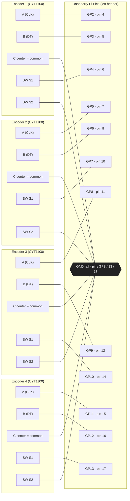
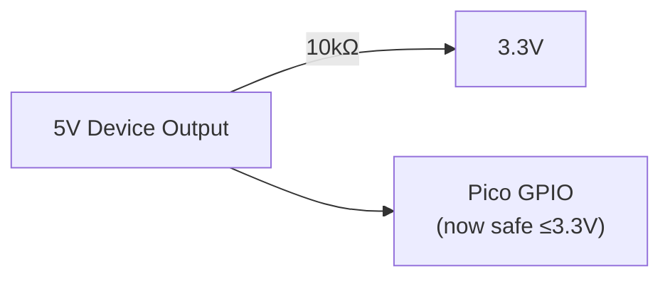
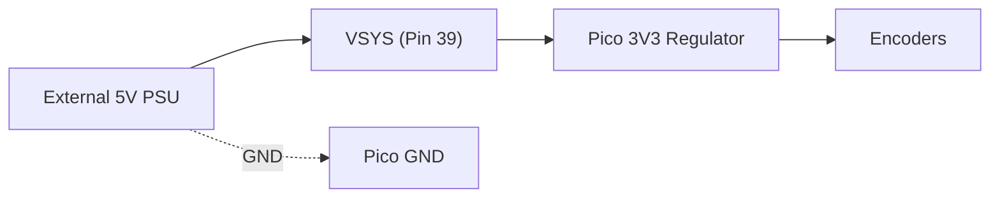
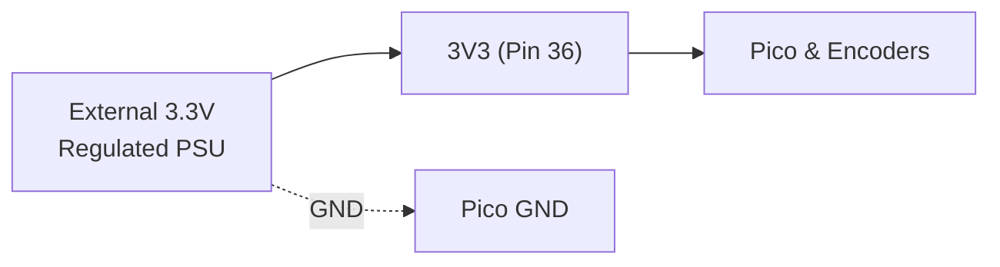

# RotaryUsb

USB Rotary Encoder Interface Using Raspberry Pi Pico

## Quick Start

This repository contains:

- **[firmware/](firmware/)** - CircuitPython firmware (easy to customize, no build required)
- **[firmware-cpp/](firmware-cpp/)** - C++ firmware (high-performance, requires Pico SDK)
- **[windows-example/](windows-example/)** - C# example for reading encoder data on Windows

### Operating Modes

RotaryUsb supports two HID modes:

| Mode | Description | Best For |
|------|-------------|----------|
| **Keyboard HID** | Sends F1-F12 key events | Quick setup, works with any app |
| **Generic HID** | Sends raw encoder data | Custom applications, precise control |

#### Keyboard HID Mode (Default)
- Device appears as a standard USB keyboard
- Encoder events trigger F1-F12 key presses  
- Works immediately with any application that accepts keyboard input
- Keys are sent globally (all applications receive them)

#### Generic HID Mode (Advanced)
- Device uses vendor-defined HID (Usage Page 0xFF00)
- Applications read raw encoder position and button states directly
- Events are exclusive to applications that open the device
- Better for precise control and custom integrations
- **Runtime configurable:** Encoder bounds, step size, acceleration, and wrapping can be configured at runtime from the Windows app and saved to device flash

### Firmware Options

| Feature | CircuitPython | C++ |
|---------|---------------|-----|
| **Startup time** | ~3-5 seconds | <100ms |
| **Latency** | ~1-5ms | <100µs |
| **Customization** | Edit text file | Recompile required |
| **Best for** | Prototyping | Production |

### Installation

#### Option A: CircuitPython (Easy)

1. Install [CircuitPython](https://circuitpython.org/board/raspberry_pi_pico/) on your Pico
2. Copy [adafruit_hid library](https://circuitpython.org/libraries) to `CIRCUITPY/lib/`
3. Copy `firmware/code.py` to the `CIRCUITPY` drive

**For Generic HID Mode:**
1. Also copy `firmware/boot.py` to the `CIRCUITPY` drive
2. Power cycle the device (unplug and replug)
3. Copy `firmware/code_generic_hid.py` as `code.py`

#### Option B: C++ (High-Performance)

1. Install [Pico SDK](https://github.com/raspberrypi/pico-sdk) and ARM GCC toolchain
2. Build the firmware:
   ```bash
   cd firmware-cpp
   mkdir build && cd build
   cmake ..
   make -j4
   ```
3. Hold BOOTSEL, connect Pico via USB, copy `rotary_usb.uf2` to the `RPI-RP2` drive

**For Generic HID Mode (C++):**
1. Backup `main.cpp` and replace it with `main_generic_hid.cpp`
2. Rebuild and flash

### Windows Example

```bash
cd windows-example
dotnet build
dotnet run
```

See the READMEs in each directory for detailed instructions.

---

# Project Plan: USB Rotary Encoder Interface Using Raspberry Pi Pico

## Overview

This project interfaces four rotary encoders, each with a push‑button shaft, to a Windows PC using a Raspberry Pi Pico. The Pico reads the rotary and button inputs and emulates a USB HID device (keyboard/media control) so Windows sees it as a standard input device.

---

## Hardware Components

- Raspberry Pi Pico (or Pico W).
- 4× rotary encoders with push‑button shafts — either type works:
  - **Bare encoders** (e.g., [Cylewet CYT1100](https://www.amazon.com/Cylewet-Encoder-Digital-Potentiometer-Arduino/dp/B07DM2YMT4) — 3+2 pin, no PCB)
  - **Module encoders** (e.g., [Cylewet KY‑040 CYT1062](https://www.amazon.com/Cylewet-Encoder-15%C3%9716-5-Arduino-CYT1062/dp/B06XQTHDRR) — 5‑pin PCB with onboard pull‑ups)
- Breadboard and jumper wires.
- USB micro‑B cable to connect Pico to PC.

Notes:

- **No external pull‑up resistors are required** with either encoder type. The firmware enables the Pico’s internal pull‑ups (~50–80 kΩ) on all encoder GPIO pins.
- Typical “5 V” KY‑040 modules are safe to use at 3.3 V with the Pico; they are just mechanical switches plus resistors.
- Bare encoders are also just mechanical switches to ground and work identically with the Pico’s internal pull‑ups — simply leave any “+” or VCC pin unconnected.

---

## Schematic and Wiring Diagram

### System Block Diagram

```mermaid
block-beta
    columns 3

    block:host:3
        columns 1
        USB_HOST["USB HOST (PC)"]
        usb_signals["USB 5V / D+ / D-"]
    end

    space:3

    block:pico:3
        columns 1
        pico_title["RASPBERRY PI PICO"]

        block:power:1
            columns 1
            power_title["POWER SECTION"]
            vbus_in["USB VBUS 5V"]
            reg["Internal 3.3V Regulator → 3V3 Pin"]
            vbus_out["VBUS Pin (5V out — use with caution)"]
        end

        block:gpio:1
            columns 1
            gpio_title["GPIO SECTION — 3.3V LOGIC\nInternal Pull-ups ENABLED (~50–80kΩ to 3.3V)"]
            enc1["GP2 ← Enc1 CLK · GP3 ← Enc1 DT · GP4 ← Enc1 SW"]
            enc2["GP5 ← Enc2 CLK · GP6 ← Enc2 DT · GP7 ← Enc2 SW"]
            enc3["GP8 ← Enc3 CLK · GP9 ← Enc3 DT · GP10 ← Enc3 SW"]
            enc4["GP11 ← Enc4 CLK · GP12 ← Enc4 DT · GP13 ← Enc4 SW"]
        end

        gnd["GND ↔ Common Ground"]
    end

    space:3

    block:encoders:3
        columns 4
        e1["Encoder 1\nCLK DT SW\n+ GND"]
        e2["Encoder 2\nCLK DT SW\n+ GND"]
        e3["Encoder 3\nCLK DT SW\n+ GND"]
        e4["Encoder 4\nCLK DT SW\n+ GND"]
    end

    usb_signals --> pico_title
    gnd --> e1
    gnd --> e2
    gnd --> e3
    gnd --> e4
```



### Wiring Diagram — CYT1100 → Pico (pin-accurate)

> **CYT1100 (bare EC11):** the 3-pin side is **A — C — B** (the **center pin C is the
> common**); the 2-pin side is an **independent push switch (S1/S2)**. Each encoder
> therefore needs **two ground wires** — its center **C** *and* one switch terminal
> **S2** — both to the GND rail. A and B may be swapped (that only flips CW/CCW, and
> is fixable with the per-encoder *Reverse* option). No resistors or "+/VCC" wire are
> needed; the Pico's internal pull-ups hold each input HIGH.



### Detailed Wiring Schematic

```
                    RASPBERRY PI PICO (Top View)
                    ┌─────────────────────────────┐
                    │         [USB PORT]          │
                    │            ┌─┐              │
                    │            └─┘              │
            GP0  ───┤ 1                        40 ├─── VBUS (5V from USB)
            GP1  ───┤ 2                        39 ├─── VSYS
            GND  ───┤ 3                        38 ├─── GND
  Enc1 CLK  GP2  ───┤ 4                        37 ├─── 3V3_EN
  Enc1 DT   GP3  ───┤ 5                        36 ├─── 3V3 (OUT) ◄── Power for encoders
  Enc1 SW   GP4  ───┤ 6                        35 ├─── ADC_VREF
  Enc2 CLK  GP5  ───┤ 7                        34 ├─── GP28
            GND  ───┤ 8                        33 ├─── GND
  Enc2 DT   GP6  ───┤ 9                        32 ├─── GP27
  Enc2 SW   GP7  ───┤ 10                       31 ├─── GP26
  Enc3 CLK  GP8  ───┤ 11                       30 ├─── RUN
  Enc3 DT   GP9  ───┤ 12                       29 ├─── GP22
            GND  ───┤ 13                       28 ├─── GND
  Enc3 SW   GP10 ───┤ 14                       27 ├─── GP21
  Enc4 CLK  GP11 ───┤ 15                       26 ├─── GP20
  Enc4 DT   GP12 ───┤ 16                       25 ├─── GP19
  Enc4 SW   GP13 ───┤ 17                       24 ├─── GP18
            GND  ───┤ 18                       23 ├─── GND
            GP14 ───┤ 19                       22 ├─── GP17
            GP15 ───┤ 20                       21 ├─── GP16
                    └─────────────────────────────┘

               ENCODER TYPE A: KY-040 MODULE (5-pin PCB)
              ┌─────────────────────────────┐
              │         ┌───────┐           │
              │         │ENCODER│           │
              │         │ KNOB  │           │
              │         └───────┘           │
              │                             │
              │  [CLK] [DT] [SW] [+] [GND]  │
              └───┬─────┬────┬───┬────┬────┘
                  │     │    │   │    │
                  │     │    │   │    └──────► Pico GND (Pin 3, 8, 13, 18, 23, 28, 33, 38)
                  │     │    │   │
                  │     │    │   └───────────► NC (leave unconnected)*
                  │     │    │
                  │     │    └───────────────► Pico GPIO (SW pin)
                  │     │
                  │     └────────────────────► Pico GPIO (DT/B pin)
                  │
                  └──────────────────────────► Pico GPIO (CLK/A pin)

              * NC = Not Connected (recommended — Pico internal pull-ups provide the HIGH reference)


               ENCODER TYPE B: BARE ENCODER (3+2 pin, no PCB)

                      ┌─────────┐
                      │  KNOB   │
                      │  SHAFT  │
                 ┌────┴─────────┴────┐
                 │   ROTARY ENCODER   │
                 └─┬──────┬──────┬───┘
                   │      │      │         3-pin side (rotary quadrature)
                   │      │      │
                   │      │      └─────────► Pico GPIO (B/DT pin)
                   │      │
                   │      └────────────────► Pico GND (center pin = common ground)
                   │
                   └───────────────────────► Pico GPIO (A/CLK pin)

                 └───┬──────┬───┘
                     │      │              2-pin side (push button)
                     │      │
                     │      └──────────────► Pico GND
                     │
                     └─────────────────────► Pico GPIO (SW pin)
```

### Breadboard Wiring Examples

#### Using KY‑040 Modules (5‑pin PCB)

```
 ENCODER 1        ENCODER 2        ENCODER 3        ENCODER 4
 ┌───────┐        ┌───────┐        ┌───────┐        ┌───────┐
 │ KY040 │        │ KY040 │        │ KY040 │        │ KY040 │
 │  ┌─┐  │        │  ┌─┐  │        │  ┌─┐  │        │  ┌─┐  │
 │  │○│  │        │  │○│  │        │  │○│  │        │  │○│  │
 │  └─┘  │        │  └─┘  │        │  └─┘  │        │  └─┘  │
 │C D S + G│      │C D S + G│      │C D S + G│      │C D S + G│
 └┬─┬─┬─┬─┬┘      └┬─┬─┬─┬─┬┘      └┬─┬─┬─┬─┬┘      └┬─┬─┬─┬─┬┘
  │ │ │ │ │        │ │ │ │ │        │ │ │ │ │        │ │ │ │ │
  │ │ │ │ │        │ │ │ │ │        │ │ │ │ │        │ │ │ │ │
  │ │ │ NC│        │ │ │ NC│        │ │ │ NC│        │ │ │ NC│
  │ │ │   │        │ │ │   │        │ │ │   │        │ │ │   │
  │ │ │   └────────┴─┴─┴───┴────────┴─┴─┴───┴────────┴─┴─┴───┴──► GND Rail
  │ │ │            │ │ │            │ │ │            │ │ │
  │ │ └──GP4       │ │ └──GP7       │ │ └──GP10      │ │ └──GP13
  │ └────GP3       │ └────GP6       │ └────GP9       │ └────GP12
  └──────GP2       └──────GP5       └──────GP8       └──────GP11
```

#### Using Bare Encoders (3+2 pin, no PCB)

```
 ENCODER 1            ENCODER 2            ENCODER 3            ENCODER 4
 ┌─────────┐          ┌─────────┐          ┌─────────┐          ┌─────────┐
 │  ┌───┐  │          │  ┌───┐  │          │  ┌───┐  │          │  ┌───┐  │
 │  │ ○ │  │          │  │ ○ │  │          │  │ ○ │  │          │  │ ○ │  │
 │  └───┘  │          │  └───┘  │          │  └───┘  │          │  └───┘  │
 │A  GND  B│          │A  GND  B│          │A  GND  B│          │A  GND  B│
 └┬───┬───┬┘          └┬───┬───┬┘          └┬───┬───┬┘          └┬───┬───┬┘
  │   │   │            │   │   │            │   │   │            │   │   │
  │   │   │            │   │   │            │   │   │            │   │   │
  │   └───┼────────────┼───┴───┼────────────┼───┴───┼────────────┼───┴───┼──► GND Rail
  │       │            │       │            │       │            │       │
  │       └──GP3       │       └──GP6       │       └──GP9       │       └──GP12
  └──────────GP2       └──────────GP5       └──────────GP8       └──────────GP11

  (Push-button pins, 2-pin side of each encoder)
  SW1  SW2            SW1  SW2            SW1  SW2            SW1  SW2
  ┬─────┬              ┬─────┬              ┬─────┬              ┬─────┬
  │     │              │     │              │     │              │     │
  │     └──► GND Rail  │     └──► GND Rail  │     └──► GND Rail  │     └──► GND Rail
  │                    │                    │                    │
  └──GP4               └──GP7               └──GP10              └──GP13
```

#### Breadboard Layout (either encoder type)

```
                        BREADBOARD LAYOUT
  ┌──────────────────────────────────────────────────────────────┐
  │  ═══════════════════════════════════════════════════════════ │◄─ Power Rail (+) (unused)
  │  ═══════════════════════════════════════════════════════════ │◄─ GND Rail (-)
  │                                                              │
  │   [ENC1]    [ENC2]    [ENC3]    [ENC4]     [PICO]           │
  │    ○ ○ ○     ○ ○ ○     ○ ○ ○     ○ ○ ○     ┌─────┐          │
  │    │ │ │     │ │ │     │ │ │     │ │ │     │ USB │          │
  │    │ │ │     │ │ │     │ │ │     │ │ │     │     │          │
  │    │ │ └─────┼─┼─┼─────┼─┼─┼─────┼─┼─┼─────┤GP4  │          │
  │    │ └───────┼─┼─┼─────┼─┼─┼─────┼─┼─┼─────┤GP3  │          │
  │    └─────────┼─┼─┼─────┼─┼─┼─────┼─┼─┼─────┤GP2  │          │
  │              │ │ └─────┼─┼─┼─────┼─┼─┼─────┤GP7  │          │
  │              │ └───────┼─┼─┼─────┼─┼─┼─────┤GP6  │          │
  │              └─────────┼─┼─┼─────┼─┼─┼─────┤GP5  │          │
  │                        │ │ └─────┼─┼─┼─────┤GP10 │          │
  │                        │ └───────┼─┼─┼─────┤GP9  │          │
  │                        └─────────┼─┼─┼─────┤GP8  │          │
  │                                  │ │ └─────┤GP13 │          │
  │                                  │ └───────┤GP12 │          │
  │                                  └─────────┤GP11 │          │
  │                                            │     │          │
  │  ═══════════════════════════════════════════════════════════ │◄─ Connect to Pico GND
  └──────────────────────────────────────────────────────────────┘

  Note: For bare encoders, the center pin on the 3-pin side and one
  push-button pin must also connect to the GND rail. For KY-040
  modules, only the GND pin needs the GND rail (leave + unconnected).
```

### Voltage Levels and Level Shifting

#### Pico GPIO Voltage Characteristics

| Parameter | Value | Notes |
|-----------|-------|-------|
| GPIO Logic Level | 3.3V | **All Pico GPIO pins are 3.3V only!** |
| GPIO Input High (VIH) | ≥2.0V | Minimum voltage to read as HIGH |
| GPIO Input Low (VIL) | ≤0.8V | Maximum voltage to read as LOW |
| GPIO Output High (VOH) | ~3.3V | Output when driving HIGH |
| GPIO Output Low (VOL) | ~0V | Output when driving LOW |
| **Absolute Maximum** | **3.63V** | **Exceeding this WILL damage the Pico!** |
| Internal Pull-up | ~50-80kΩ | Pulls GPIO to 3.3V when enabled |

#### Why Level Shifting and External Pull‑Ups are NOT Required

Both KY‑040 modules and bare encoders work safely with the Pico without any external resistors because:

1. **Open-Drain/Open-Collector Operation**: All rotary encoder outputs (CLK/A, DT/B, SW) are mechanical switches that connect to GND when activated. They do not output voltage — they only pull the line LOW. This is true for both bare encoders and module encoders.

2. **Pull-up Resistor Source**: The Pico's internal pull‑ups (~50–80 kΩ to 3.3 V) define the HIGH voltage level. No external pull‑ups are needed:
   - **Bare encoders** have no onboard resistors at all — the Pico's internal pull‑ups are sufficient.
   - **KY‑040 modules** have onboard 10 kΩ pull‑ups, but these are either not connected (if you leave the `+` pin unconnected) or safely connected to 3.3 V (if you wire `+` to Pico 3V3). Either way, the Pico's internal pull‑ups work in parallel.

3. **Safe Signal Flow (both encoder types)**:
   ```mermaid
   flowchart LR
       V3["3.3V"] -- "~50–80kΩ\n(internal pull-up)" --> GPIO["Pico GPIO"]
       GPIO --- SW["Encoder Switch"]
       SW --> GND["GND"]
   ```

   - **Switch OPEN:** GPIO reads HIGH (3.3V from internal pull-up)
   - **Switch CLOSED:** GPIO reads LOW (connected to GND through switch)

#### ⚠️ CRITICAL: Voltage Warnings

| DO ✓ | DON'T ✗ |
|------|---------|
| Connect encoder `+` to Pico 3V3 (36) | Connect encoder `+` to 5V/VBUS (40) |
| Leave encoder `+` unconnected (NC) | Apply >3.63V to any GPIO pin |
| Use Pico's internal pull-ups | Mix 5V and 3.3V logic without level shifters |
| Share common GND between all devices | Float GND connections |

#### If Using Active 5V Sensors or Modules

For other components that output 5V logic signals (NOT applicable to standard rotary encoders), you would need level shifting:



Alternatively, use a dedicated level shifter IC (e.g., TXS0108E, BSS138-based).

### Power Supply Requirements

#### Power Budget Analysis

| Component | Typical Current | Max Current | Voltage |
|-----------|----------------|-------------|---------|
| Raspberry Pi Pico | 25-50mA | 100mA (active) | 5V via USB or 1.8-5.5V via VSYS |
| KY-040 Encoder (×4) | ~0.5mA each | 2mA each | 3.3V |
| Total System | ~30mA typical | ~110mA max | - |

#### Power Supply Options

**Option 1: USB Power (Recommended)**


**Option 2: External 5V Supply via VSYS**



Useful for standalone/embedded applications.

**Option 3: External 3.3V Supply via 3V3 Pin**



Bypasses internal regulator. Use regulated 3.3V only (not 3.7V).

#### Power Supply Recommendations

1. **For Development/Normal Use**: USB power is sufficient and safest
2. **For Standalone Applications**: Use a quality 5V regulated supply via VSYS
3. **Current Capacity**: Minimum 200mA recommended (provides headroom)
4. **USB Cable Quality**: Use a data-capable USB cable with adequate wire gauge (24 AWG or better for power)

---

## Encoder Pinout And Pico Wiring

### Compatible Encoder Types

This project supports two common encoder form factors. Both are mechanical switches internally and work with the Pico's internal pull‑ups — **no external pull‑up resistors are needed**.

#### Type A: KY‑040 Module (5‑pin PCB)

A rotary encoder soldered onto a small breakout board with labeled pins and onboard 10 kΩ pull‑up resistors.

Example: [Cylewet KY‑040 CYT1062 (5‑pack)](https://www.amazon.com/Cylewet-Encoder-15%C3%9716-5-Arduino-CYT1062/dp/B06XQTHDRR)

```
  KY-040 MODULE (top view)
  ┌─────────────────────┐
  │      ┌───────┐      │
  │      │ENCODER│      │
  │      │ KNOB  │      │
  │      └───────┘      │
  │  [R1]  [R2]  [R3]   │  ← Onboard 10kΩ pull-up resistors
  │                      │
  │ [CLK] [DT] [SW] [+] [GND]
  └──┬─────┬────┬───┬────┬──┘
     │     │    │   │    │
     A     B   SW  VCC  GND
```

**Pins:** CLK (A), DT (B), SW (button), + (VCC), GND

#### Type B: Bare Encoder (3+2 pin, no PCB)

A standalone encoder component with no breakout board and no onboard resistors. Pins are split across two sides of the encoder body.

Example: [Cylewet CYT1100 (5‑pack with knob caps)](https://www.amazon.com/Cylewet-Encoder-Digital-Potentiometer-Arduino/dp/B07DM2YMT4)

```
  BARE ENCODER (side view)

       ┌─────────┐
       │  KNOB   │
       │  SHAFT  │
  ┌────┴─────────┴────┐
  │                    │
  │   ROTARY ENCODER   │
  │                    │
  └─┬──────┬──────┬───┘
    │      │      │        ← 3-pin side (rotary)
    A    GND(C)   B

  └───┬──────┬───┘
      │      │             ← 2-pin side (push button)
     SW1    SW2
```

**3‑pin side:** A (CLK), C (common/GND), B (DT)
**2‑pin side:** SW1, SW2 (push button — normally open, either pin can be GND)

### Typical encoder pins

For a common 5‑pin rotary encoder module (KY‑040‑style):

- A (CLK) – Quadrature signal 1.
- B (DT) – Quadrature signal 2.
- SW – Push‑button output.
- + – Optional VCC (often labeled 5V but workable at 3.3 V).
- GND – Ground.

For a bare encoder (3+2 pin):

- A – Quadrature signal 1 (3‑pin side, outer pin).
- C – Common/ground (3‑pin side, center pin).
- B – Quadrature signal 2 (3‑pin side, outer pin).
- SW1/SW2 – Push‑button terminals (2‑pin side, normally open).

Internally, all encoder types are just switches that connect to ground when activated; the microcontroller provides pull‑ups.

### GPIO assignment

Use 4 encoders × (A, B, SW) = 12 GPIO pins. All encoders share GND rails.

#### Wiring: KY‑040 Module (5‑pin)

| Encoder | CLK → | DT → | SW → | + (VCC) | GND → |
|---------|-------|------|------|---------|-------|
| 1       | GP2   | GP3  | GP4  | NC (leave unconnected) | Pico GND |
| 2       | GP5   | GP6  | GP7  | NC (leave unconnected) | Pico GND |
| 3       | GP8   | GP9  | GP10 | NC (leave unconnected) | Pico GND |
| 4       | GP11  | GP12 | GP13 | NC (leave unconnected) | Pico GND |

#### Wiring: Bare Encoder (3+2 pin)

| Encoder | A → | B → | C (center) → | SW1 → | SW2 → |
|---------|-----|-----|--------------|-------|-------|
| 1       | GP2 | GP3 | Pico GND     | GP4   | Pico GND |
| 2       | GP5 | GP6 | Pico GND     | GP7   | Pico GND |
| 3       | GP8 | GP9 | Pico GND     | GP10  | Pico GND |
| 4       | GP11| GP12| Pico GND     | GP13  | Pico GND |

Wiring rules:

- Connect all encoder GND/common pins to any Pico GND pins (tie grounds together on the breadboard).
- For KY‑040 modules: leave the “+” pin unconnected (NC). The Pico's internal pull‑ups provide the HIGH reference.
- For bare encoders: connect the center pin (C) to GND. Connect one push‑button pin to GPIO and the other to GND.
- Each signal pin (A/B/SW) goes directly to its assigned Pico GPIO — no level shifting or external pull‑up resistors needed.

Debounce and direction:

- Use software debouncing for the SW button.
- Use a proper quadrature decoding routine or library for A/B (either interrupt‑based or fast polling) to avoid miscounts.

---

## Development Environment And Firmware Stack

### Choice of firmware

The plan assumes CircuitPython on the Pico because:

- It has built‑in `usb_hid` support and an easy HID API via Adafruit HID library.
- There is a reference project implementing **4 encoders + buttons as a USB keyboard** using a Pico (`usb_keyboard_button_box_pico`).

You can later port to C/C++ with the Pico SDK if you want lower‑level control.

### Setup steps

1. **Install CircuitPython on Pico**  
   - Download the latest Raspberry Pi Pico `.uf2` for CircuitPython from Adafruit.  
   - Hold BOOTSEL, plug Pico into USB, copy the `.uf2` to the exposed drive; the board will reboot into CircuitPython and appear as `CIRCUITPY`.

2. **Prepare development tools**  
   - Install VS Code or Thonny and point it at the `CIRCUITPY` drive.  
   - Optionally install the CircuitPython extension in VS Code for easy upload and REPL access.

3. **Install required CircuitPython libraries**  
   - From the Adafruit CircuitPython bundle, copy at least:  
     - `adafruit_hid` (for keyboard/media HID).  
     - `rotaryio` if your CircuitPython build supports it for direct encoder reading, or implement your own A/B logic as in existing Pico rotary examples.  

4. **Clone or reference example project**  
   - Look at `usb_keyboard_button_box_pico` for a working 4‑encoder + button HID keyboard implementation and wiring style on Pico.

---

## Firmware Design

### Functional goals

- Enumerate as a USB HID keyboard (or composite HID including consumer control for media keys).
- For each encoder:
  - Clockwise step → send configurable key (e.g., `F1`/`F3`/`F5`/`F7` or media volume up).
  - Counter‑clockwise step → send another key (e.g., `F2`/`F4`/`F6`/`F8` or media volume down).
  - Button press → send a third key (e.g., `F9–F12` or play/pause/mute).
- Debounce and rate‑limit events so holding or fast spins do predictable things (e.g., repeat every N detents).

### High‑level structure

1. **Board and HID initialization**
   - Import `board`, `digitalio`, optionally `rotaryio`, and `usb_hid` / `adafruit_hid.keyboard.Keyboard` plus keycodes.
   - Initialize a `Keyboard` or `ConsumerControl` instance bound to `usb_hid.devices`.
   - Configure GPIO for all A/B/SW pins as inputs with pull‑ups enabled.

2. **Encoder abstraction**
   - Create an `Encoder` class holding:
     - Pins A/B (and optionally an internal count / last_state variable).
     - Button pin with debounce tracking.
     - Keycodes for CW, CCW, and button press actions.
   - Implement `update()` that:
     - Checks the current A/B state vs last state to detect a detent and direction.
     - On CW: send HID event (e.g., `keyboard.send(Keycode.F1)`).
     - On CCW: send HID event (e.g., `Keycode.F2`).
     - Debounces and edge‑detects button press and sends its keycode on press.

3. **Main loop**
   - Run a tight loop calling `update()` for each encoder.
   - Insert a small delay (e.g., 1–2 ms) to balance CPU use and responsiveness.
   - Optionally print debug output via `print()` for each event and monitor via REPL/serial console.

4. **Config and mapping**
   - Store key mappings in a `dict` or a simple config section at top of the file.
   - Example default mapping (similar to the reference button box):
     - Enc0 CW/CCW → `F1` / `F2`.
     - Enc1 CW/CCW → `F3` / `F4`.
     - Enc2 CW/CCW → `F5` / `F6`.
     - Enc3 CW/CCW → `F7` / `F8`.
     - Buttons for enc0–enc3 → `F9`–`F12`.

---

## Step‑By‑Step Implementation Plan

1. **Bring‑up single encoder**
   - Wire encoder 1 only (A→GP2, B→GP3, SW→GP4, GND shared, plus 3V3 or no + pin as chosen).  
   - Write minimal CircuitPython script to:
     - Print encoder position and button pressed status to serial.
     - Verify correct direction and detent counts.

2. **Add USB HID keyboard behavior**
   - Add `usb_hid` + `adafruit_hid.keyboard` to your script.
   - Map CW to one key (e.g., Right Arrow) and CCW to another (Left Arrow) to test in a text editor.
   - Map the button press to Space or Enter to verify on Windows.

3. **Scale to 4 encoders**
   - Duplicate encoder abstraction for four instances with the full GPIO map (GP2–GP13).
   - Ensure the update loop handles all four encoders every iteration.
   - Confirm no cross‑talk or missed steps by spinning multiple encoders simultaneously.

4. **Debounce tuning and robustness**
   - Implement:
     - Button debounce (e.g., ignore changes within 10–20 ms).
     - Optional detent filtering for encoder using state machine or threshold on change rate.
   - Test with fast spins and rapid clicking.

5. **Windows testing and integration**
   - Plug the Pico directly into a Windows PC USB port.
   - Verify:
     - Device shows as “USB Keyboard” or your custom HID name in Device Manager.
     - Keys appear correctly in a key tester or text editor.
   - Map the keys in your target application (DAW, CAD, IDE hotkeys, etc.).

6. **Optional enhancements**
   - Make key mappings configurable via a small config file on the `CIRCUITPY` drive.
   - Add a mode switch button to swap profiles (e.g., IDE profile vs DAW profile).
   - Add RGB LEDs or a small display to show current mode.

---

## Risks And Mitigations

- **Noisy or bouncy encoders**  
  - Use proper software debounce and a quadrature state machine; consider using `rotaryio.Encoder` if supported in your CircuitPython version.

- **Wrong wiring (5 V risk)**
  - For KY‑040 modules: ensure encoder “+” is never tied to 5 V (VBUS); leave it unconnected (NC) or wire to 3.3 V only.
  - For bare encoders: ensure signal pins (A, B, SW) connect only to Pico GPIO pins, and common/ground pins connect only to Pico GND.

- **HID not appearing**  
  - Ensure CircuitPython build has HID enabled and `usb_hid` is imported and not disabled in `boot.py`.

---

## GitHub Copilot Agent Prompt

The following prompt can be used with GitHub Copilot to implement or extend RotaryUsb functionality:

```
Implement support for reading RotaryUsb rotary encoder input as a custom Generic HID device (not as a keyboard):

1. **Firmware:**
   - In `boot.py`, set the device to use a Vendor-Defined HID report descriptor for 4 encoders and buttons (suggest Usage Page 0xFF00, input report 4-8 bytes).
   - In `code.py`, modify main loop to send encoder/button state with send_report() calls (not Keyboard.send()).
   - Document the HID report bytes layout, and provide instructions for modifying report size if additional encoders/buttons are needed.

2. **Windows C# Example:**
   - Use the HidLibrary NuGet package to find the device by VID/PID and UsagePage and continuously read incoming HID reports.
   - Parse bytes to extract each encoder/button state.
   - Provide commented code in `windows-example/Program.cs` that supports live printing and optionally, application handling logic.
   - Document how to build and run the sample, and how the encoder/button values map to bytes.

3. **Documentation:**
   - Update all firmware and example READMEs to explain both modes: HID Keyboard mode and Generic HID mode.
   - Include detailed instructions for setting up, flashing, and coding against the Generic HID report.
   - Give troubleshooting guidance for HID access on Windows and Linux.

Include a section outlining the difference between Keyboard and Generic HID operation, and recommended use cases for each.
```

---


